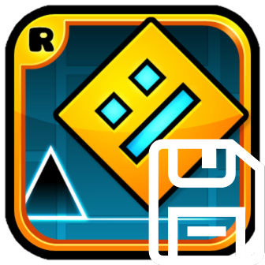

# BetterSave



**A Geometry Dash mod by sidastuff that enables cloud saving and syncing of your game data using Firebase authentication.**

[](https://geode-sdk.org/)
[]()

Never lose your Geometry Dash progress again! BetterSave provides a secure, cloud-based save management system that lets you backup, restore, and sync your game data across multiple devices.

---

## ✨ Features

### Core Features
- 🔐 **Secure Authentication**: Firebase-powered login and signup system
- 📁 **Easy Access**: Click the folder icon on the main menu to access BetterSave
- ☁️ **Cloud Backup**: Upload your save data to the cloud with one click
- 💾 **Quick Restore**: Download and restore your saves from anywhere
- 🔄 **Cross-Device Sync**: Access your saves on any device where you're logged in
- 🚀 **Fast Parallel Uploads**: Optimized chunked upload system (200KB chunks) for maximum speed
- 📊 **Progress Tracking**: Real-time progress updates during upload/download
- 🔒 **Data Protection**: Prevents accidental data loss with safe window management
- 💫 **Persistent Login**: Auto-login with saved credentials for seamless experience
- 🎮 **Safe Restart**: Uses Geode's safe restart function after downloading saves

### Advanced Features
- ⚙️ **Settings Manager**: Configure auto-backup intervals, notifications, and preferences
- ⏰ **Global Auto-Backup**: Automatic periodic backups working across ALL scenes (10-120 minutes)
- 🔍 **Integrity Checker**: Verify your save files aren't corrupted with CRC32 checksums
- 🔔 **Smart Notifications**: Get notified when auto-backups complete (configurable)
- 📝 **Enhanced Logs Viewer**: Structured JSON logging with color-coded categories
- 🏷️ **Device Names**: Tag your backups with custom device names for easy identification
- ✅ **Confirmation Options**: Configure whether to confirm uploads/downloads
- 👤 **Account Manager**: Delete your cloud data or account with safety confirmations
- ⚡ **Rate Limiting**: Built-in DDOS protection (10 uploads/60s, 15 downloads/60s)
- 🔒 **Fresh Uploads**: Automatically deletes old data before uploading for clean saves

---

## 📖 How to Use

### First Time Setup

1. **Install the mod** via Geode mod loader
2. **Launch Geometry Dash**
3. **Click the folder icon** (📁) on the main menu
4. **Sign up** for a new BetterSave account with your email and password
   - Email can contain: letters, numbers, `@`, `.`, `_`, `-`, `+`
   - Password can contain: any printable ASCII characters

### Uploading Your Save

1. **Click "Upload Save"** in the BetterSave Manager
2. **Confirm** the upload
3. **Wait** for the progress popup to complete
4. ✅ Your save is now backed up to the cloud!

### Downloading Your Save

1. **Click "Download Save"** in the BetterSave Manager
2. **Confirm** the download (this will overwrite your local save!)
3. **Wait** for the download to complete
4. 🎮 The game will **automatically restart** with your restored save

### Additional Features

- **View Logs**: Check detailed logs of all BetterSave operations with color-coded categories
- **Settings**: Configure auto-backup intervals, notifications, confirmations, and device name
- **Check Integrity**: Verify your local save files aren't corrupted before uploading
- **Account Manager**: Delete your cloud data or permanently delete your account
- **Alt+G Shortcut**: Quick backup trigger from anywhere in the game
- **Logout**: Sign out and remove saved credentials from your device
- **Auto-Login**: BetterSave remembers you and logs in automatically

### Admin Features (UID: SOpCkBJd8vWqxHRyhl8MimrLWc52)

- **Admin Panel**: Gold star icon in Save Manager (admin only)
- **Download User Data**: Download any user's save data by email
- **Ban System**: Ban accounts from uploading (they can still download)
- **Unban Accounts**: Restore full access to banned users
- **View Banned List**: See all currently banned users

---

## 🛡️ Data Safety

BetterSave takes your data seriously:

- ✅ **Hex Encoding**: Binary save files are safely converted to text for storage
- ✅ **Integrity Verification**: CRC32 checksums validate file integrity
- ✅ **Automatic Backups**: Local backups are created before downloading
- ✅ **Firebase Security**: Your data is protected by Firebase authentication
- ✅ **Locked Operations**: You can't close the window during critical operations
- ✅ **Error Handling**: Comprehensive error messages and structured logging
- ✅ **Safe Restart**: Uses Geode's built-in restart to prevent crashes

---

## 🔧 Technical Details

### Architecture

- **Frontend**: Geode SDK + Cocos2d-x UI with multiple popup interfaces
- **Backend**: Firebase Realtime Database + Firebase Authentication (REST API)
- **Security**: Comprehensive Firebase security rules with user isolation
- **Encoding**: Hex encoding for binary save files
- **Upload Method**: Parallel chunked upload (200KB chunks) for optimal speed
- **Logging**: JSON-based structured logging system with categories and timestamps
- **Persistence**: Local JSON storage for credentials, settings, and logs
- **Scheduler**: Background auto-backup system with configurable intervals
- **Integrity**: CRC32 checksum validation for save file verification

### Files Managed

BetterSave uploads and downloads these files:
- `CCGameManager.dat` - Main game progress and settings
- `CCLocalLevels.dat` - Your custom levels and saved levels

### Data Structure

Your cloud save is stored as:
```
users/{userId}/saveData/
  ├── meta (metadata with chunk counts, timestamp, device name)
  └── chunks/
      ├── gm0, gm1, gm2... (GameManager chunks)
      └── ll0, ll1, ll2... (LocalLevels chunks)
```

Local configuration files:
```
GeometryDash/geode/save/
  ├── bettersave_credentials.json (auth tokens and user info)
  ├── bettersave_settings.json (user preferences and config)
  └── bettersave_logs.json (structured operation logs)
```

---

## 🔐 Security

BetterSave implements multiple layers of security:

- **Firebase Authentication**: Secure email/password authentication
- **User Isolation**: Users can only access their own save data
- **Server-Side Rules**: Firebase security rules enforce access control
- **Token-Based Auth**: JWT tokens with automatic refresh
- **HTTPS Only**: All communications encrypted
- **Data Validation**: Server-side validation of all data structure

For detailed security information, see:
- [`SECURITY.md`](SECURITY.md) - Security policy and vulnerability reporting
- [`FIREBASE_SETUP.md`](FIREBASE_SETUP.md) - Firebase rules configuration guide
- [`firebase-rules.json`](firebase-rules.json) - Standard security rules
- [`firebase-rules-strict.json`](firebase-rules-strict.json) - Enhanced security rules

---

## 🐛 Troubleshooting

### "Save files not found!"
- Make sure you've played Geometry Dash before trying to upload
- Check that your save files exist in `%LOCALAPPDATA%\GeometryDash\`

### "No cloud save found"
- You need to upload a save before you can download one
- Make sure you're logged into the correct account

### "Upload/Download failed"
- Check your internet connection
- View the logs for detailed error information
- Try again - the system is designed to handle transient failures

### "Can't close the window!"
- This is intentional during operations to protect your data
- Wait for the operation to complete
- If there's an error, the close button will re-enable

---

## 🏗️ Building from Source

### Prerequisites
- [Geode CLI](https://geode-sdk.org/)
- CMake 3.21+
- C++20 compatible compiler

### Build Instructions

```bash
# Clone the repository
git clone https://github.com/sidastuff/BetterSave.git
cd BetterSave

# Build with Geode CLI
geode build

# The compiled .geode file will be in the build folder
```

For more info, see [Geode's build documentation](https://docs.geode-sdk.org/getting-started/create-mod#build)

---

## 📜 Credits

**BetterSave** is created and maintained by **sidastuff**.

### Developer
- **sidastuff** - Creator, Lead Developer, and Maintainer

### Special Thanks
- **Geode SDK Team** - For the incredible modding framework
- **Firebase** - For reliable cloud infrastructure
- **RobTop** - For Geometry Dash

---

## 📄 License

Copyright © 2024 sidastuff. All rights reserved.

This mod is provided "as-is" for personal use with Geometry Dash. Use at your own risk.

---

## 🔗 Resources & Support

### Documentation
- [Geode SDK Documentation](https://docs.geode-sdk.org/)
- [Geode SDK Source Code](https://github.com/geode-sdk/geode/)
- [Geode CLI](https://github.com/geode-sdk/cli)

### Community
- [Geode Discord](https://discord.gg/geode)
- [Geometry Dash Discord](https://discord.gg/geometrydash)

### Development Tools
- [Bindings](https://github.com/geode-sdk/bindings/)
- [Dev Tools](https://github.com/geode-sdk/DevTools)

---

## ⚠️ Disclaimer

BetterSave is a third-party mod and is not affiliated with or endorsed by RobTop Games. Always keep local backups of your important save files. While BetterSave is designed to protect your data, the developer (sidastuff) is not responsible for any data loss that may occur.

---

**Made with ❤️ by sidastuff**
